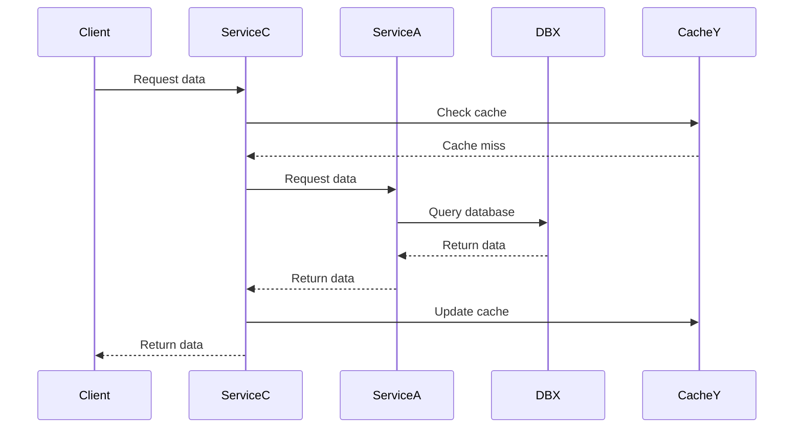

```markdown
# Architecture

## Component Diagram

```mermaid
componentDiagram
    component "Service A" as ServiceA
    component "Service B" as ServiceB
    component "Service C" as ServiceC
    database "Database X" as DBX
    database "Cache Y" as CacheY

    ServiceA --> DBX : Reads/Writes
    ServiceB --> DBX : Reads
    ServiceB --> CacheY : Reads/Writes
    ServiceC --> ServiceA : Calls
    ServiceC --> CacheY : Reads
```

## Sequence Diagram (Happy Path)



## Service Matrix

| Service   | Port | Depends On        | Environment          |
|-----------|------|-------------------|----------------------|
| Service A | 8080 | Database X        | production, staging  |
| Service B | 8081 | Database X, Cache Y | production, staging  |
| Service C | 8082 | Service A, Cache Y | production, staging  |

## Environment Variables

| Name              | Description                  | Default       |
|-------------------|------------------------------|---------------|
| SERVICE_A_PORT    | Port for Service A            | 8080          |
| SERVICE_B_PORT    | Port for Service B            | 8081          |
| SERVICE_C_PORT    | Port for Service C            | 8082          |
| DBX_CONNECTION   | Connection string for Database X | unknown       |
| CACHEY_ENDPOINT  | Endpoint URL for Cache Y       | unknown       |
| ENVIRONMENT      | Deployment environment          | production    |

## Operational Runbook

### Start

```bash
# Start Service A
docker run -d -p 8080:8080 service-a

# Start Service B
docker run -d -p 8081:8081 service-b

# Start Service C
docker run -d -p 8082:8082 service-c
```

### Health Check

```bash
curl -f http://localhost:8080/health
curl -f http://localhost:8081/health
curl -f http://localhost:8082/health
```

### Logs

```bash
docker logs <container_id_of_service_a>
docker logs <container_id_of_service_b>
docker logs <container_id_of_service_c>
```

### Stop

```bash
docker stop <container_id_of_service_a>
docker stop <container_id_of_service_b>
docker stop <container_id_of_service_c>
```
```